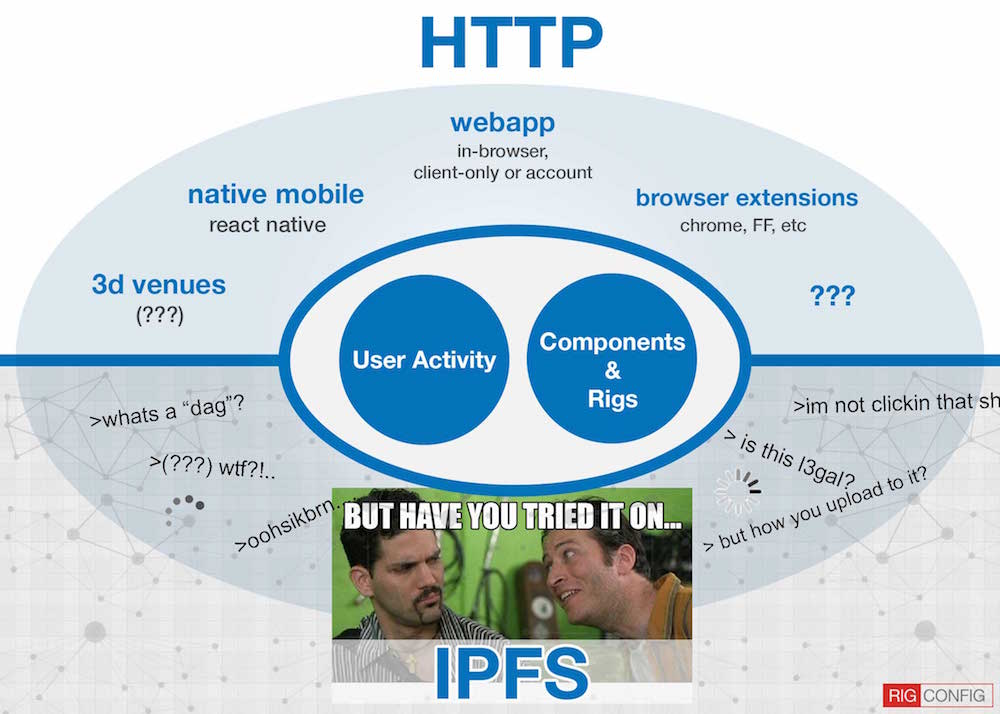

# Quick Links
  - [Issue Tracker](https://gitlab.com/rigconfig/rigconfig/issues) - Report bugs, feature requests, suggestions, pull requests, etc.
  - [Dev Board](https://gitlab.com/rigconfig/rigconfig/boards) - Current development, what's being worked on, etc.
  - [Docs](./.docs/index.md)
  - [Twitter](https://twitter.com/rigconfig)
  - Email: [smonsen@devwax.com](mailto:smonsen@devwax.com)
  - [CCDB](https://gitlab.com/rigconfig/ccdb) - *Open Source Computer Component Database* repository developed in conjunction w/ RigConfig.

# Table of Contents
  - [About](#about)
  - [Contribute](#how-to-contribute)
  - [Installation](#installation)
  - [Other Notes](#other-notes)
  - [Vision & Roadmap](#vision-roadmap)
  - [Thinking Out Loud](#thinking-out-loud)
  - [License](#license)

# About
RigConfig is an open source computer configurator. See [rigconfig.com](http://rigconfig.com)

- Meteor & React
- Client-only-first (Amplify.js + Local Collections for persistence)
- Publish rigs anonymously
- Rigs can be forked, modified, shared
- Custom user-contributed components
- Open Source Component Database
  - *(See: [CCDB](https://gitlab.com/rigconfig/ccdb) - Computer Component Database)*
- [Whitelisted](#link-whitelisting) links allowed in public rig description and custom components.
- Fully open api and database to provide maximum flexibility for 3rd party development and interoperability with other systems.
- Future plans:
  - 3D component specifications using [Three.js](https://threejs.org/examples/#webgl_loader_collada_keyframe) for web, mobile and VR. *(See: [CCDB](https://gitlab.com/rigconfig/ccdb))*
  - Peer-to-Peer via WebRTC, IPFS, etc.
- MIT Licensed
- Separate MIT licensed database of computer components - *(See: [CCDB](https://gitlab.com/rigconfig/ccdb))*

# How To Contribute
  - Post in the [Issue Tracker](https://gitlab.com/rigconfig/rigconfig/issues) w/ suggestions, questions, bugs, etc.
  - See [Dev Board](https://gitlab.com/rigconfig/rigconfig/boards) to see what's being worked on at the moment.
  - [Initiate a pull request](https://docs.gitlab.com/ee/gitlab-basics/add-merge-request.html#how-to-create-a-merge-request)
  - For help or other discussion see [Quick Links](#quick-links) above for contact info and forums.

# Installation

Requirements:
  - [Git](https://git-scm.com/book/en/v2/Getting-Started-Installing-Git)
  - [Node](https://github.com/creationix/nvm#installation)
  - [NPM](https://docs.npmjs.com/getting-started/installing-node#updating-npm)
  - [Meteor](https://github.com/meteor/meteor#quick-start)

### Clone Repository Locally

**HTTPS:** ```git clone https://gitlab.com/rigconfig/rigconfig.git```

**SSH:** ```git clone git@gitlab.com:rigconfig/rigconfig.git```

### Clone forked version of meteorhacks/inject-data
```
cd packages/
git clone https://github.com/rigconfig/inject-data.git
```
*(fixes broken server side rendering)*

### Setup Algolia API Credentials (optional)

**Note:** Skip this part if you don't need the algolia faceting or search features working. The search and faceting will not work w/out setting up your own algolia account and index until we have a native fallback.

**See Issue:** [Algolia search and faceting is mandatory and has no fallback](https://gitlab.com/rigconfig/rigconfig/issues/22)

- Copy `/.docs/rigconfig-settings-dev.json.template`
- to `../../anywhere-ouside-of-repo/rigconfig-settings-dev.json`
- Update w/ your Algolia api credentials in settings file.
- Remove the multi-line comment `/* */` in settings file. *(causes errors)*
- Create new algolia index called `rigconfig_components`
- Import db into new index using file: `imports/startup/server/fixtures/official_components/algolia_index.json`

### Run

```
cd rigconfig/
npm i
meteor --settings ~/Dropbox/.deploy/rigconfig-settings-dev.json
open http://localhost:3000
```

### Load components into local meteor mongo database

The components are stored in a separate open source repository [CCDB](https://gitlab.com/rigconfig/ccdb).

- Clone [ccdb](https://gitlab.com/rigconfig/ccdb) repo to your computer anywhere outside of the rigconfig directory.
- Make sure your local rigconfig meteor installation is running.
- Move into the `ccdb/utils/` dir.
- Open `import_json.js`
- Edit the mongo connection details near the top of the file to:
  - `mongo_host = localhost`
  - `mongo_port = 3001`
  - `mongo_db = meteor`
- Then run `node import_json.js` from terminal
- This will read all the computer components stored in `ccdb/src/json/**/*.json` and insert them into your running meteor mongo database w/ separate collections for each component type _(i.e. cpus, motherboards, etc)_.

### Uninstall
From root of repository:

```
cd ../
rm -rf ./rigconfig/
```

# Other Notes
This is an early development version of the site. There is a lot of prototype cruft in the repo, no test coverage to speak of, a laundry list of yet unimplemented features and at this point admonishments like, "the apis will change", are a gross understatement; in the event that there even was a documented api beyond those built into Meteor & React. Time heals all repos.

# Vision & Roadmap (brainstorming)
  - [Flux / Redux](http://stackoverflow.com/questions/32461229/why-use-redux-over-facebook-flux) state management w/ SSR and [Apollo](http://www.apollostack.com/). Currently using [React Router SSR](https://github.com/thereactivestack-legacy/meteor-react-router-ssr) w/ a [reactive-dict](https://atmospherejs.com/meteor/reactive-dict) for app state / store (AppState.js) and a single object containing actions (Actions.js)
  - 3D components - [example 1](https://threejs.org/examples/#webgl_loader_collada_keyframe), [example 2](https://sketchfab.com/models/cf088e43284248f6bdd4c0d3dc4fd18a) *(blender, maya, etc => three.js)*
  - P2P - [IPFS](https://gitlab.com/ipfs/js-ipfs), [webRTC](https://gitlab.com/webrtc/samples), [redux-swarm](https://gitlab.com/philholden/redux-swarmlog), etc ([decentralization](https://gitlab.com/ipfs/awesome-ipfs#single-page-webapps))
  - Collaborative 3d spaces and venues. ([The Computer Show & Sale](https://www.youtube.com/watch?v=wFf-mMxo8JI) meets [Star Citizen stores](https://youtu.be/_jyGoubaNNM?t=33m24s) via HTC Vive)
  - Users can add their own links for components, rigs, research, etc (retail, affiliate, etc)
  - Chrome extension
  - Mobile w/ React Native
  - A hosted / self-hosted themeable version (like magento, wordpress, etc) for system builders, retailers, power users, etc. Or at least a useful enough API that a user can leverage their presence on rigconfig w/ their own endeavors elsewhere.



# Thinking Out Loud
Exposition by way of a few undigested thoughts better suited to a blog post, but it isn't ready yet.

## Pricing
Instead of maintaining a continually updated monolithic database of current pricing data from third party sources or apis and all the headaches which that portends, user contributed pricing data should be good enough for now.

I originally intended for the app to simply replace notepads and bookmarks that are used when shopping for and comparing components; not necessarily a real-time price feed. Because what I usually want to know is what the price is of what I'm actually buying from a specific source, rather than a momentary ball park figure not incorporating current sales, deals, new/used/oem, shipping, etc.

Also, if users are able to add their own links and prices and make them public *(well aware, see: [Link Whitelisting](#link-whitelisting))*, it wouldn't be too difficult to use this data which represents only those components that people have demonstrated an interest in the price of (and where), instead of a pre-calculated database of prices from a small handful of sources.

And with [Link Whitelisting](#link-whitelisting) this would allow users to add their own affiliate or retail links and pricing for arbitrary sources if moderated appropriately. E.g. System builders with their own sites and/or eBay, Amazon or other merchants who may want to add their inventory and custom pricing and so forth.

Cathedral vs Bazaar... Bridges to be crossed at a later date.

## Compatibility
A measure of how many other Rigs use a certain component should suffice until such time that a more quantitatively certain approach to compatibility is developed *(the database and schema are unfinished atm)*. If 100+ other Rigs use a certain combination of, say, motherboard and video card, chances are it's compatible; qualitative confidence vs quantitative certainty.

## Link Whitelisting
Markdown and links can be used in descriptions of rigs and components. To cut down on potential abuse and spam there is a whitelist database of links that will pass through validation and display on public user-contributed descriptions. To request a domain or link to be approved for whitelisting, pleasse post in the [issue tracker](https://gitlab.com/rigconfig/rigconfig/issues).

## A note about PCPP & other similar apps...
  - I was unaware of PCPP's existence until about five months into development.
  - I've deliberately continued to limit my exposure to the site so as to continue fleshing out my own vision for RigConfig. Will check it out later.
  - If there is demand for some level of interoperability with other sites or apps like PCPP (import/export formatting, etc) I would be more than happy to add the feature(s) or merge pull requests and so forth.
  - My motivating philosophy behind RigConfig is to help people do what they are already doing in a more succinct and collaborative way, not for it to to get in the way. So any service, app, api, forum/venue, etc, that adds value or that people use should work with the app.

# License
  - [MIT](LICENSE)
